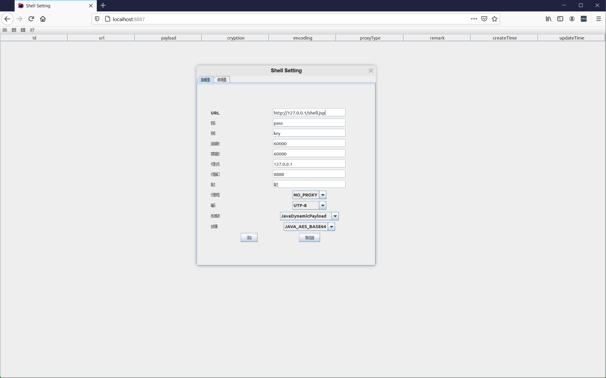

# Jetbrains Projector Docker Runner

Run Swing based GUI application within the Docker container through the [Jetbrains Projector](https://github.com/JetBrains/projector-server), and access it from browsers.

## Usage

The easiest way to start a Swing GUI application inside a docker container is through the pre-built Docker image [tuwen/projector](https://hub.docker.com/repository/docker/tuwen/projector):

```
docker run -it --rm --name projector \
    -p 8887:8887 \
    -v /path/to/swing-gui-application.jar:/opt/projector/swing-gui-application.jar \
    tuwen/projector swing-gui-application.jar
```

When the server is launched, you can open `localhost:8887` in the browser to access the app.

Specify the launching Main-Class for the jar archive:

```
docker run -it --rm --name projector \
    -p 8887:8887 \
    -v /path/to/swing-gui-application.jar:/opt/projector/swing-gui-application.jar \
    tuwen/projector swing-gui-application.jar org.example.Main
```

## Demo

A demo for [Godzilla](https://github.com/BeichenDream/Godzilla):



## License

Same as Jetbrains Projector.
